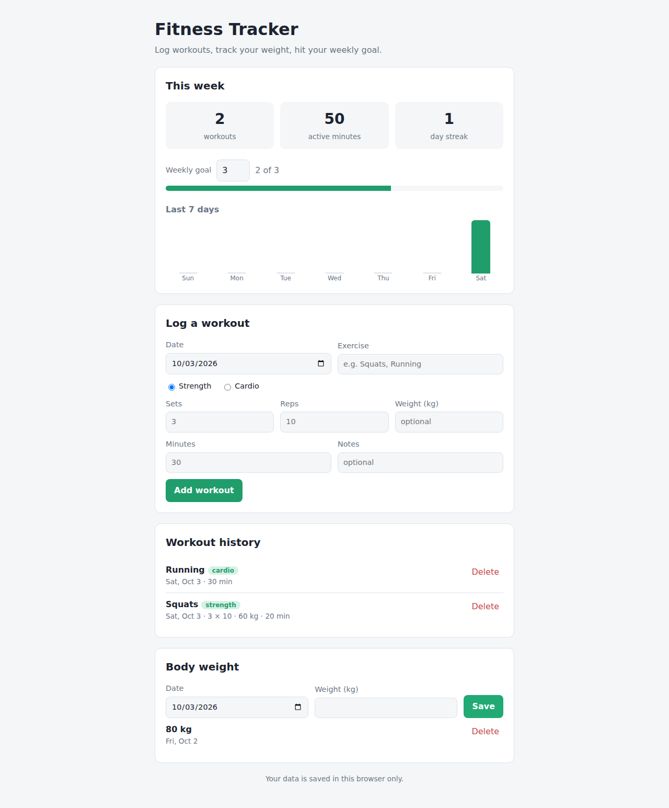

# Fitness Tracker

A simple fitness tracker that runs in your web browser. No installs, no accounts.

## Features

- **Log workouts**: strength (sets, reps, weight) or cardio (minutes)
- **Weekly stats**: workouts this week, active minutes, day streak
- **Weekly goal**: set a target and watch the progress bar fill
- **Last 7 days chart**
- **Body weight**: log weigh-ins and see a line chart

## How to run it

1. Download or clone this repository.
2. Open the `fitness-tracker` folder.
3. Double-click `index.html` and it opens in your browser.

Your data is saved in the browser you use (via `localStorage`). Clearing your
browser data will erase it.

## How the code is organized

| File         | What it does                                   |
|--------------|------------------------------------------------|
| `index.html` | The structure of the page (sections, forms)    |
| `style.css`  | How it looks (colors, layout, dark mode)       |
| `app.js`     | How it works (saving data, stats, charts)      |

`app.js` is split into numbered sections with comments, so it's easiest to read
top to bottom.
